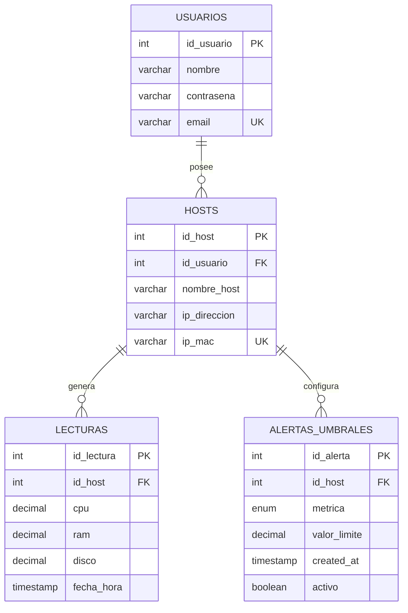

# Diagrama Entidad-Relación — Monitor

## Notas de diseño

- **`hosts.id_usuario`** es la diferencia clave respecto a versiones
  anteriores del proyecto: ahora cada equipo monitoreado pertenece a un
  usuario específico, no es global para todos los usuarios.
- **`ip_mac` es única** (`UNIQUE`) porque se usa para identificar de qué
  host viene cada lectura que manda el colector de Python — dos hosts no
  pueden compartir la misma MAC.
- **`lecturas`** usa una fila por medición con columnas separadas
  (`cpu`, `ram`, `disco`) en vez de una fila por métrica, porque el
  colector siempre manda las tres juntas y así una sola consulta trae
  todo para graficar.
- **`activo`** en `alertas_umbrales` permite desactivar una alerta sin
  borrarla del historial.
